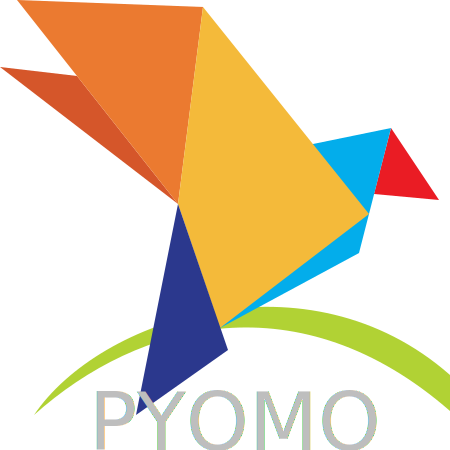

# Rodrigo Celso de Lima Porto
Formado em Engenharia de Produção pela Universidade Federal Fluminense. Atualmente estou me especializando na área de Engenharia de Dados. Tenho bastante experiência em projetos relacionados à automação de processos ETL por meio de programação em VBA, DAX e Power Query, além de ter realizado projetos em plataformas low-code como Power Apps e Power Automate. No momento, estou focando em projetos de automação com Python e SQL como consolidação para a minha carreira profissional como Engenheiro de Dados.

## Hard Skills

### ✍️🎨 Linguagens de Marcação e Estilo

### 💻 Linguagens de Programação

### 🛠️ Ferramentas

### 📚 Bibliotecas e Frameworks

### Plataformas Low-Code

## GitHub Stats

## Linguagens mais usadas

## 👇 Você pode me encontrar aqui

